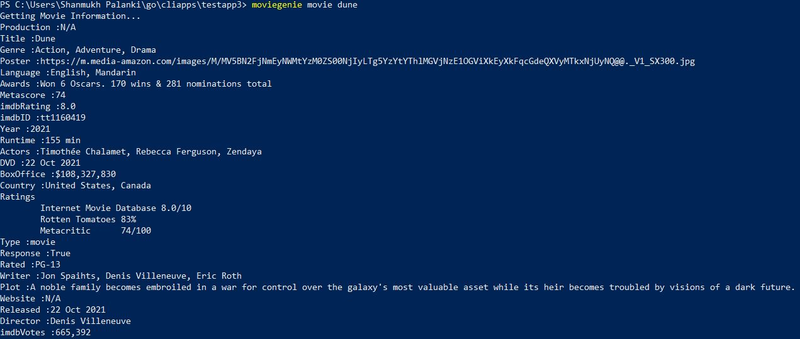

# Movie Info API - Command Line Application
A Command Line Application using Go Lang for fetching the Movie data through an API using the given input and then displaying it.

## Demo :

## Library :
Cobra - Library for creating command line applications

## API :
OMDB API - A RESTful API for Movie Information
